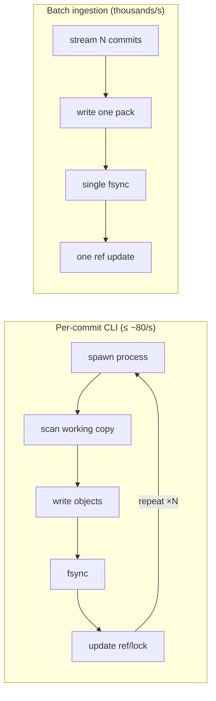
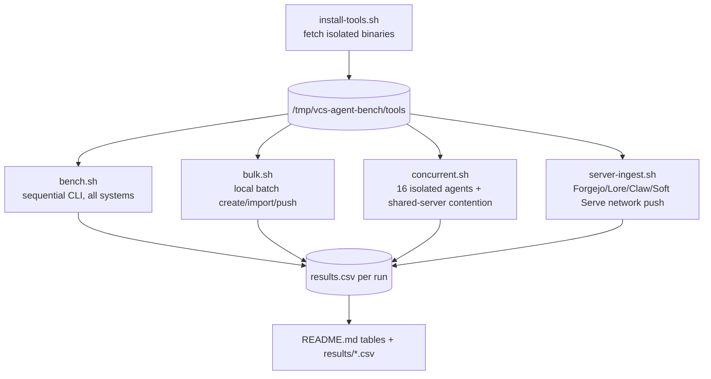
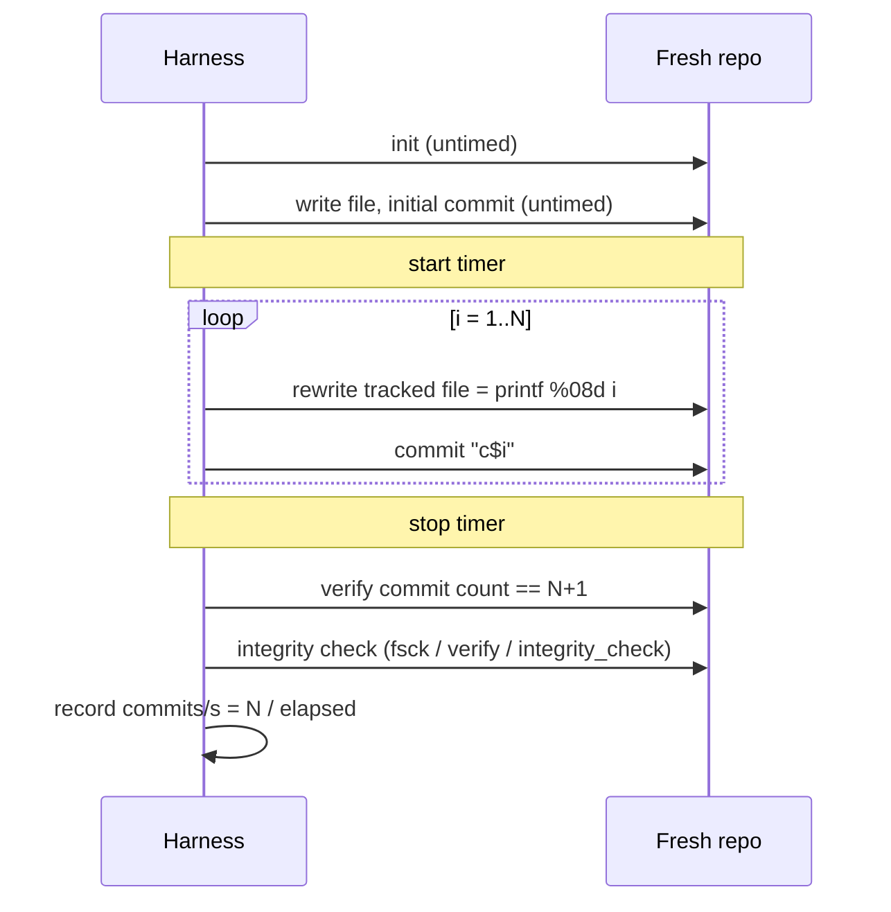
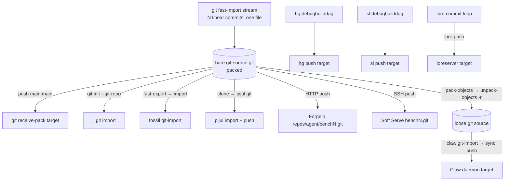
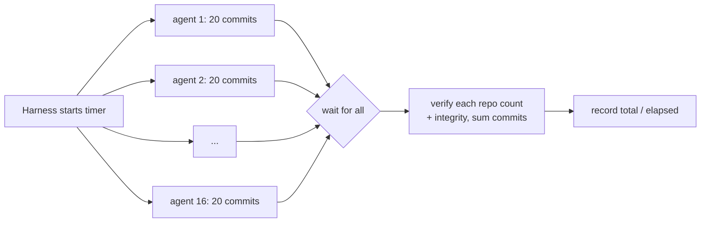

# Agent VCS benchmark

How fast can a version-control system absorb writes from automated agents? This
benchmark measures three workloads — one ordinary CLI change at a time, a single
large batch, and many independent agents committing at once — across 14
mainstream, niche, and brand-new systems, all on one machine with fresh
repositories for every trial.

Run on 2026-08-12 in the supplied workspace container.

## Systems tested

| System | What it is | Home |
|---|---|---|
| Git | The ubiquitous content-addressed DVCS | <https://git-scm.com/> |
| Jujutsu (`jj`) | Git-compatible VCS with an operation log | <https://github.com/jj-vcs/jj> |
| Mercurial | Python revlog DVCS | <https://www.mercurial-scm.org/> |
| Sapling | Meta's Git-compatible client (Mononoke server) | <https://sapling-scm.com/> |
| Fossil | Single-file SQLite DVCS + forge | <https://fossil-scm.org/> |
| Pijul | Patch-theory VCS on the Sanakirja store | <https://pijul.org/> |
| Perforce | Centralized Helix Core server | <https://www.perforce.com/products/helix-core> |
| Forgejo | Self-hosted Git forge (Gitea fork) | <https://forgejo.org/> |
| Lore | Epic Games' content-addressed VCS | <https://github.com/EpicGames/lore> |
| Claw VCS | Intent/agent-native VCS with a gRPC daemon | <https://github.com/Shree-git/claw-vcs> |
| Twigg | Go stacked-commit VCS | <https://github.com/twigg-vc/monorepo> |
| Soft Serve | Charm's Git-over-SSH host | <https://github.com/charmbracelet/soft-serve> |
| Oxen | ML-data version control | <https://github.com/Oxen-AI/Oxen> |
| Mononoke | Sapling's scalable server (no OSS binary) | <https://github.com/facebook/sapling> |

## Machine

- Intel Xeon Platinum 8175M, 16 logical CPUs exposed
- cgroup CPU quota: 8 cores
- 61 GiB RAM
- Linux 6.12, Ubuntu 24.04
- overlay filesystem for both `/tmp` and the workspace
- other workspace services were active during the original run, so its concurrent trials show more variance than the later re-run (see the two-run comparison below)

## Versions

- [Git](https://git-scm.com/) 2.43.0
- [Jujutsu](https://github.com/jj-vcs/jj) 0.44.0, Git backend
- [Mercurial](https://www.mercurial-scm.org/) 7.2.4
- [Sapling](https://sapling-scm.com/) 0.2.20260522-084851+1e764c94
- [Fossil](https://fossil-scm.org/) 2.27
- [Pijul](https://pijul.org/) 1.0.0-beta.21
- [Perforce](https://www.perforce.com/products/helix-core) P4/P4D 2026.1 build 2972966
- [Forgejo](https://forgejo.org/) 16.0.1 with SQLite
- [Lore](https://github.com/EpicGames/lore) 0.8.6
- [Claw VCS](https://github.com/Shree-git/claw-vcs) 0.1.0
- [Twigg](https://github.com/twigg-vc/monorepo) at Git commit `3dd94af`
- [Soft Serve](https://github.com/charmbracelet/soft-serve) 0.12.2 with SQLite
- [Oxen](https://github.com/Oxen-AI/Oxen) 0.53.0

## Headline comparison

Every system in one table. The local-CLI column is median commits/s over three
repetitions of the one-file workload; the batch column is each system's fastest
measured server/bulk ingestion path; the concurrent column is the **re-run**
median (see the two-run comparison for the original numbers and the caveats).
`—` means the path was not applicable or not measured. Store is approximate
target size after a 5,000-commit history.

| System | Local CLI commits/s (50×3) | Batch / server ingestion rev/s | 16-agent concurrent commits/s | ~Store @ 5k |
|---|---:|---:|---:|---:|
| [Claw VCS](https://github.com/Shree-git/claw-vcs) | **78.49** | 2,223.09 (gRPC push) | 159.72 | 63 MiB |
| [Pijul](https://pijul.org/) | **59.83** | 1,317.37 (local push) | 308.58 | 424 MiB (import) |
| [Git](https://git-scm.com/) (default) | **52.88** | 7,704.56 (receive-pack) | 252.28 | 1.5 MiB |
| [Git](https://git-scm.com/) (`core.fsync=all`) | **51.11** | 7,619.34 (receive-pack) | 263.32 | 1.5 MiB |
| [Perforce](https://www.perforce.com/products/helix-core) | **36.59** | — | 4.40¹ | — |
| [Twigg](https://github.com/twigg-vc/monorepo) | **32.28** | — | 126.69 | 0.24 MiB |
| [Lore](https://github.com/EpicGames/lore) | **17.96** | 482.39 (server push, 1k) | —² | — |
| [Lore](https://github.com/EpicGames/lore) (`--sync-data`) | **16.85** | 228.98 (server push) | —² | — |
| [Oxen](https://github.com/Oxen-AI/Oxen) | **15.95** | — | 87.60 | — |
| [Jujutsu](https://github.com/jj-vcs/jj) | **1.82** | 6,076.32 (Git import) | 7.42 | +0.6 MiB |
| [Fossil](https://fossil-scm.org/) | **1.80** | 612.10 (sync) | 8.01 | 8 MiB |
| [Mercurial](https://www.mercurial-scm.org/) | **1.11** | 1,794.04 (local push) | 5.76 | 1.6 MiB |
| [Sapling](https://sapling-scm.com/) | **1.08** | 1,337.27 (local push) | 4.50 | 4.2 MiB |
| [Forgejo](https://forgejo.org/) | — | 826.27 (HTTP push) | 14.52 | — |
| [Soft Serve](https://github.com/charmbracelet/soft-serve) | — | 719.66 (SSH push) | —² | — |

¹ Perforce concurrent is carried over from the original run — its server was not
rebuilt for the re-run. ² Lore and Soft Serve were not measured concurrently
(see [caveats](#caveats-lore-and-soft-serve-concurrent)).

The single most important result is the **~30–150× gap between per-commit CLI
throughput and batch ingestion** for the same content. No ordinary CLI workflow
approached 1,000 commits/s; every batch/server path that amortizes work across
commits did. The rest of the report explains why.

## Coverage matrix

Which system was measured on which workload. Sequential and batch numbers are
from the original run; concurrent is from the comprehensive re-run.

| System | Sequential CLI | Batch / ingestion | 16-agent concurrent |
|---|:--:|:--:|:--:|
| Git (default) | ✓ | ✓ | ✓ |
| Git (`fsync=all`) | ✓ | ✓ | ✓ |
| Jujutsu | ✓ | ✓ | ✓ |
| Mercurial | ✓ | ✓ | ✓ |
| Sapling | ✓ | ✓ | ✓ |
| Fossil | ✓ | ✓ | ✓ |
| Pijul | ✓ | ✓ | ✓ |
| Claw | ✓ | ✓ | ✓ |
| Twigg | ✓ | — ³ | ✓ |
| Oxen | ✓ | — ³ | ✓ |
| Perforce | ✓ | — ⁴ | ✓ ¹ |
| Forgejo | n/a (host) | ✓ | ✓ |
| Lore | ✓ | ✓ | — ² |
| Soft Serve | n/a (host) | ✓ | — ² |

³ Twigg/Oxen ship no bulk-ingestion path comparable to the others (Twigg's forge
needs a full web bootstrap; Oxen targets large files, not many small commits).
⁴ Perforce `submit` is inherently one-at-a-time; it has no stream-ingestion
equivalent to `receive-pack`.

## Detailed results

### One ordinary CLI change at a time

Each trial used a fresh repository, one tracked file rewritten with fixed-width
content, 50 timed commits, and three repetitions. Repository creation and the
initial commit were excluded. Values are median commits/s with the observed
range in parentheses.

| System | commits/s |
|---|---:|
| [Claw VCS](https://github.com/Shree-git/claw-vcs), local snapshot | **78.49** (76.56–78.50) |
| [Pijul](https://pijul.org/), signed change | **59.83** (58.80–60.14) |
| [Git](https://git-scm.com/), default durability | **52.88** (52.22–53.35) |
| [Git](https://git-scm.com/), `core.fsync=all` | **51.11** (47.61–51.20) |
| [Perforce](https://www.perforce.com/products/helix-core), authenticated `edit` + server `submit` | **36.59** (36.31–36.72) |
| [Twigg](https://github.com/twigg-vc/monorepo), local commit | **32.28** (31.66–32.79) |
| [Lore](https://github.com/EpicGames/lore), local commit | **17.96** (17.24–18.27) |
| [Lore](https://github.com/EpicGames/lore), local commit `--sync-data` | **16.85** (16.45–17.59) |
| [Oxen](https://github.com/Oxen-AI/Oxen), local commit | **15.95** (14.07–16.65) |
| [Jujutsu](https://github.com/jj-vcs/jj) | **1.82** (1.72–1.83) |
| [Fossil](https://fossil-scm.org/), forced hash detection | **1.80** (1.79–1.84) |
| [Mercurial](https://www.mercurial-scm.org/) | **1.11** (0.93–1.55) |
| [Sapling](https://sapling-scm.com/), Git-compatible storage | **1.08** (1.05–1.08) |

Pijul was fastest among the mature tools in this workload, narrowly ahead of Git,
but it is still a beta and every change was signed through a local SSH agent.
Claw was fastest overall but is a v0.1 experimental prototype (see maturity
notes). The sub-2/s systems (Jujutsu, Mercurial, Sapling, Fossil) pay a fixed
per-invocation cost on every commit — Python interpreter startup for
Mercurial/Sapling, working-copy snapshot + operation-log write for Jujutsu, a
synchronous SQLite transaction for Fossil.

### A batch and server-ingestion pass

Linear history changing the same small file in every commit, pushed into fresh
targets. Most systems used a 5,000-commit history; Lore used 1,000; the
`--sync-data` Lore row is a 200-commit incremental push. Medians of three
repetitions except where noted.

| System/path | rev/s | Notes |
|---|---:|---|
| [Git](https://git-scm.com/) `receive-pack` | **7,704.56** | Local transport, fresh bare target |
| [Git](https://git-scm.com/) `receive-pack`, `core.fsync=all` | **7,619.34** | Full object/ref hardening |
| [Jujutsu](https://github.com/jj-vcs/jj) Git import | **6,076.32** | Zero-copy metadata import; not server ingestion |
| [Git](https://git-scm.com/) `fast-import` creation | **4,238.79** | Creates 15,000 commit/tree/blob objects |
| [Claw](https://github.com/Shree-git/claw-vcs) gRPC push | **2,223.09** | 5,000 revisions, unauthenticated daemon |
| [Claw](https://github.com/Shree-git/claw-vcs) authenticated gRPC push | **2,002.81** | 5,000 revisions, one trial |
| [Mercurial](https://www.mercurial-scm.org/) push | **1,794.04** | Local repository transport |
| [Sapling](https://sapling-scm.com/) push | **1,337.27** | OSS eager storage, local transport |
| [Pijul](https://pijul.org/) push | **1,317.37** | Local transport; one large trial |
| [Forgejo](https://forgejo.org/) HTTP push | **826.27** | Full forge path, SQLite, loopback HTTP |
| [Soft Serve](https://github.com/charmbracelet/soft-serve) authenticated SSH push | **719.66** | 5,000 Git commits over SSH |
| [Fossil](https://fossil-scm.org/) sync | **612.10** | Local sync protocol |
| [Mercurial](https://www.mercurial-scm.org/) `debugbuilddag` creation | **586.65** | Internal bulk generator |
| [Lore](https://github.com/EpicGames/lore) server push | **482.39** | 1,000 revisions, three fresh repositories |
| [Fossil](https://fossil-scm.org/) Git import | **443.64** | Incremental import |
| [Lore](https://github.com/EpicGames/lore) server push, `--sync-data` | **228.98** | 200 incremental revisions, one trial |
| [Sapling](https://sapling-scm.com/) `debugbuilddag` creation | **188.36** | Internal bulk generator |
| [Pijul](https://pijul.org/) Git import | **18.09** | 276.5 s, ~3.8 GiB peak RSS; poor scaling |

The fully hardened Git batch was only ~1.1% slower than default Git, because
thousands of immutable objects shared one pack and one ref update. Forgejo was
stable at 824–830 commits/s, ~9.3× slower than bare `receive-pack`. Claw's own
gRPC server was the only smaller project to cross 1,000 rev/s.

Approximate target storage after 5,000 small commits was 1.5 MiB for Git,
1.6 MiB for Mercurial, 4.2 MiB for Sapling, 8 MiB for Fossil, 63 MiB for Claw
(15,000 loose objects), and 424 MiB for the Pijul Git import. Jujutsu added about
0.6 MiB of metadata while reusing the existing Git object store.

### Sixteen independent agents — two runs compared

The concurrent workload was run twice with the identical setup — 16 agents each
making 20 changes (320–321 total), 3 repetitions:

- **Run 1 (original)** — the initial session, taken while other workspace
  services were active. Only four systems were exercised concurrently.
- **Run 2 (re-run)** — a later, comprehensive pass on a quieter machine covering
  every applicable system.

CLI systems (git, jj, hg, sl, fossil, pijul, oxen, twigg) run 16 fully isolated
repositories. Servers (perforce, claw, forgejo) run 16 clients against one
shared server, so their number reflects central write contention.

Per-run CSVs live in [`results/`](results/):
[`concurrent-run1-original.csv`](results/concurrent-run1-original.csv),
[`concurrent-run2-rerun.csv`](results/concurrent-run2-rerun.csv) (per-rep), and
[`concurrent-run2-rerun-summary.csv`](results/concurrent-run2-rerun-summary.csv).

| System | Run 1 median c/s (range) | Run 2 median c/s (range) | Change |
|---|---:|---:|---:|
| [Pijul](https://pijul.org/) | 103.48 (100.24–306.61) | **308.58** (292.70–325.20) | +198% |
| [Git](https://git-scm.com/) (`fsync=all`) | 260.61 (239.01–261.41) | **263.32** (257.17–274.44) | +1% |
| [Git](https://git-scm.com/) (default) | 167.69 (113.92–261.44) | **252.28** (233.77–261.77) | +50% |
| [Claw](https://github.com/Shree-git/claw-vcs) | — | **159.72** (145.65–163.91) | new |
| [Twigg](https://github.com/twigg-vc/monorepo) | — | **126.69** (122.90–127.23) | new |
| [Oxen](https://github.com/Oxen-AI/Oxen) | — | **87.60** (79.39–88.45) | new |
| [Forgejo](https://forgejo.org/) | — | **14.52** (14.41–14.72) | new |
| [Fossil](https://fossil-scm.org/) | — | **8.01** (7.98–8.07) | new |
| [Jujutsu](https://github.com/jj-vcs/jj) | — | **7.42** (7.38–7.66) | new |
| [Mercurial](https://www.mercurial-scm.org/) | — | **5.76** (5.64–5.78) | new |
| [Sapling](https://sapling-scm.com/) | — | **4.50** (4.49–4.51) | new |
| [Perforce](https://www.perforce.com/products/helix-core) | 4.40 (single trial) | — (server gone) | — |

The large shifts (Pijul +198%, Git default +50%) are **machine-load artifacts,
not code changes**. Run 1's concurrent trials were explicitly noisy — note
Git-default's 114–261 range in Run 1 versus its tight 234–262 in Run 2. The two
runs agree that:

- Isolated CLI processes still stayed well below 1,000/s even at 16-wide.
- Git and Pijul scale near-linearly with agents (their per-commit path holds no
  shared lock); the Python and SQLite tools (hg/sl/fossil/jj) stay slow because
  the per-commit fixed cost dominates whether serial or parallel.
- Central servers pay for contention: Forgejo's 826 rev/s single-stream drops to
  14.5 c/s across 16 competing HTTP pushes, and Perforce's shared `db.*` tables
  collapsed to ~4.4/s.

**Not measured concurrently:** Lore's client leaves lingering server connections
that stall the parallel harness (`wait` never returns), and Soft Serve's SSH
server throttles simultaneous sessions so 16 concurrent pushes did not complete
within a hard 180 s timeout. Both are host-side concurrency limits rather than
VCS write-throughput measurements, so they are omitted rather than reported with
a misleading number. Their single-stream server numbers are in the batch table.

## Analysis: architecture and tunable parameters

The benchmark is really a probe of four architectural choices — **per-commit
process cost**, **durability/fsync policy**, **object packing**, and **server
concurrency control**. Each system sits somewhere different on those axes, and
each axis is a knob you could turn to trade throughput for safety or scale.

### Why the CLI-vs-batch gap exists

A CLI commit pays fixed per-invocation overhead — process spawn, config parse,
index/working-copy scan, one or more `fsync`s, a ref/lock update — that a batch
path pays *once* for the whole history. `git receive-pack` writes thousands of
objects into a single pack and does one ref update; `git commit` in a loop does
all of it 5,000 times. This is the dominant effect in the whole benchmark and it
is architectural, not incidental.

### Per-system notes and the knob that would move each one

| System | Architecture | Dominant per-commit cost | Parameter hypothesis to test |
|---|---|---|---|
| **Git** | Loose objects → pack; refs as files | fsync + ref lock | `core.fsync`/`fsyncMethod`; batch via `fast-import`/`receive-pack`; `commit-graph`, `core.untrackedCache` |
| **Jujutsu** | Git object backend + operation log + auto working-copy snapshot | op-log write + WC snapshot every command | `--ignore-working-copy`, reduce op-log fsync, batch with revsets; import reuses Git objects (6,076/s) |
| **Mercurial / Sapling** | Revlog / eager storage, Python CLI | **interpreter startup** dominates the ~1/s rate | `chg` / command-server to amortize startup; native `push`/`debugbuilddag` already hit 590–1,800/s |
| **Fossil** | Single SQLite DB, one transaction per commit | synchronous SQLite commit | `PRAGMA synchronous`, `journal_mode=WAL`, `--nosync`; import path is 443/s vs 1.8/s |
| **Pijul** | Patch theory + Sanakirja COW B-tree; per-change signing | signing via SSH agent + patch record | Drop/disable signing; Git-import is O(n) with huge constants (18/s, 424 MiB) |
| **Perforce** | Central server, synchronous submit into shared `db.*` | server round-trip + metadata lock | Batch files per `submit`; the metadata db serializes submits, so per-agent depot paths do **not** remove contention |
| **Forgejo** | Full forge over Git http backend (auth, hooks, DB) | forge middleware per push | SQLite → Postgres; disable hooks/webhooks/notifications; "slow POST … receive-pack" is the overhead vs bare `receive-pack` |
| **Soft Serve** | Thin SSH wrapper around `git receive-pack` | SSH handshake + git process per push | Connection reuse / MaxStartups tuning; tracks Git closely (719/s) because it *is* Git underneath |
| **Claw** | Content-addressed, 3 loose objects/commit, gRPC daemon | no packing; global store lock under concurrency | Pack objects (63 MiB → ~1.5 MiB); per-ref locking would recover concurrency; importer needs to read packed Git objects |
| **Lore** | Layered content-addressed store, deferred flush | 10 s deferred store flush hides real durability cost | `flush_delay_seconds` / `--sync-data` is the durability knob (17.96 → 16.85 local, 482 → 229 push) |
| **Oxen** | Merkle dir-hashes, ML-data oriented | many small file writes per commit | Optimized for large files, not many tiny commits; batching or the server path would help |
| **Twigg** | Go, stacked commits, local vs server ids | Go process + commit write | The local-id → server-id assignment is the interesting scale question |

### Cross-cutting knobs, ranked by expected impact

1. **Batching / transport** — the biggest lever by two orders of magnitude. Any
   system that can ingest a stream (`fast-import`, `receive-pack`, gRPC push,
   `debugbuilddag`) leaves the per-commit CLI path far behind.
2. **Durability policy** — `git core.fsync`, Fossil `PRAGMA synchronous`, Lore
   `flush_delay_seconds`/`--sync-data`. Cheap on batch (one fsync amortized),
   expensive per-commit. Lore's default 10 s deferred flush makes its default
   numbers optimistic; the `--sync-data` row is the honest durability signal.
3. **Process-startup elimination** — worth ~50× for Mercurial/Sapling via a
   persistent command server (`chg`). Irrelevant to compiled single-binary tools.
4. **Object packing** — storage and, for servers, concurrency. Claw's 15,000
   loose objects (63 MiB) vs Git's single 1.5 MiB pack is the clearest example.
5. **Server concurrency control** — per-ref vs global locking (Claw), DB backend
   (Forgejo), shared metadata tables (Perforce), SSH session limits (Soft Serve).
   This is what collapses under the 16-agent workload.

## Benchmark design (diagrams)

### Overall harness

### How one sequential trial is measured

Repository creation and the initial commit are **outside** the timer; only the
N content-changing commits are timed.

### How commits are produced for the batch pass

Every commit rewrites the same 8-byte file, so history is linear and content is
deterministic. The source is generated once via `git fast-import`, then fed to
each system's fastest ingestion path. Claw needs loose objects, so the packed
source is exploded first.

### How the concurrent pass fans out

Isolated-agent systems (git, jj, hg, sl, fossil, pijul, oxen, twigg) give each
agent its own repository. Shared-server systems (perforce, claw, forgejo) point
all 16 agents at one server, so their number measures contention.

## Integrity and comparability

- Git repositories passed `git fsck`.
- Mercurial repositories passed `hg verify`.
- Perforce revisions passed `p4 verify`.
- Fossil databases passed SQLite `integrity_check`.
- Pijul histories were counted and its Sanakirja debug check completed.
- Sapling history counts were checked; its public `sl verify` command is a no-op.
- Claw histories were counted from `claw log --json`; its `admin preflight`
  fsync probe passed and all revisions remained readable after daemon shutdown.
- Lore, Twigg, and Oxen histories were counted from their own log commands; Oxen
  additionally exposes an `fsck` subcommand for version files.

This tested process-level correctness, not power-loss recovery, multi-AZ
replication, failover, malicious inputs, hooks, CI, search indexing, or review
event fan-out.

## Maturity caveats for the newer systems

- **Claw VCS** was the fastest local CLI and the only smaller project past
  1,000 rev/s on its own server, but it is explicitly v0.1 experimental: 15,000
  loose objects (63 MiB vs 1.5 MiB packed), a Git importer that failed on
  ordinary *packed* Git objects, and heavy throughput loss under concurrent
  small pushes. A promising prototype, not a hosting recommendation.
- **Lore** has a serious centralized/content-addressed design but did not beat
  Git, Forgejo, or Soft Serve on small-text histories. Its default local server
  uses a 10-second deferred store flush; the `--sync-data` result is the
  durability-relevant one. Pre-1.0, with a web code-review client still on the
  roadmap.
- **Twigg**'s full forge was not benchmarked (its self-host bootstrap needs the
  web app, browser-created credentials, Node assets, and extra services); only
  the standalone local VCS was measured, and it was slower than Git.
- **Oxen** is credible for large data sets, but its semantics and optimizations
  target ML data rather than source-code hosting, and its small-change rate was
  below Git.
- **Mononoke** (Sapling's scalable server) has no supported OSS binary in the
  public release, so it was not assigned a number.

## Reproduction

- `install-tools.sh`: fetch the extra binaries (Forgejo, Lore, Claw, Soft Serve, Oxen, Twigg) into the isolated tool tree
- `bench.sh`: sequential CLI commits — all systems (Git, Jujutsu, Mercurial, Sapling, Fossil, Pijul, Perforce, Claw, Twigg, Lore, Oxen)
- `bulk.sh`: bulk creation, import, and local push (Git, Jujutsu, Fossil, Pijul, Mercurial, Sapling)
- `concurrent.sh`: 16-agent isolated commits and shared-server contention — all systems (`SYSTEMS=` selects a subset; `lore` is opt-in only)
- `server-ingest.sh`: network/server ingestion (Forgejo HTTP, Lore server, Claw gRPC + concurrent, Soft Serve SSH)
- `forgejo.ini`: isolated Forgejo benchmark configuration; benchmark-only secrets
- `results/`: per-run concurrent CSVs (original vs re-run)

The scripts expect the binaries under `/tmp/vcs-agent-bench/tools` as installed
by `install-tools.sh` (and the base VCS toolchain from the original run). They
intentionally create fresh repositories for every trial. Pijul signs each change
through a local SSH agent; if the agent socket at `$BENCH_ROOT/ssh-agent.sock`
is stale, restart it and `ssh-add` the key under `pijul-home/.ssh/` before
running the Pijul cases.
